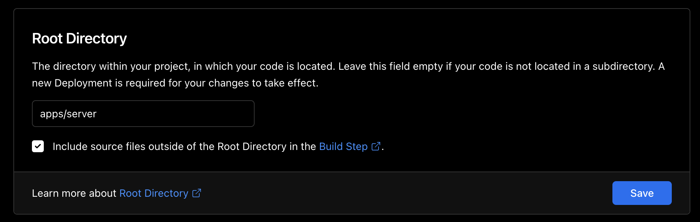

# Welcome to [Turbo Hybrid Astro on Vercel](https://turbo-hybrid-astro-on-vercel.vercel.app/)

Demo site: https://turbo-hybrid-astro-on-vercel.vercel.app/

Currently, Astro doesn't support a `hybrid` mode for a Astro projects `output`.
You can either opt-in for `server` or `static`. Both have their own pro's and con's.
However, a Next.js-like hybrid project configurable is desirable, as you might want
to generate many pages purely statically (SSG), but still like to serve some dynamically (SSR).

There is a [RFC discussion](https://github.com/withastro/rfcs/pull/362) going on
towards supporting this, and it also landed on the [feature roadmap for Q4/2022](https://github.com/withastro/rfcs/discussions/302).

This repo spike a solution implementation that fully supports this use-case with the latest
Astro version (1.6.2). I'm contributing this code as a simple reproduction template for
people who are looking for a solution right now, and also as a proposal to the current discussion.

Proposal for the current discussion: [Spike results](https://github.com/kyr0/turbo-hybrid-astro-on-vercel#spike-result)

## Project layout

This project uses `turbo`, namely `turborepo` to configure a monorepo with 2 Astro projects.

This project deploys on [Vercel](https://vercel.com/). You can clone this repo and deploy it on Vercel.
Make sure to set the root directory to: `apps/server` as this is the primary Astro project we deploy!



You can find the Vercel configuration in `apps/server/vercel.json`. It makes sure that `turbo` is used.
I've also decided to activate [Remote Caching](https://turbo.build/repo/docs/core-concepts/remote-caching).

### Apps

There are two `apps`, one for SSG, the other for SSR. SSG / `server` is primarily deployed to Vercel.

- `apps/server`: SSR / `server` output Astro project. Renders the dynamic pages.
- `apps/static`: SSG / `static` output Astro project. Renders all static pages and resources to `apps/static/dist`

### Shared packages

Shared packages are located in `packages/*`, such as:

- `packages/components`: Astro components to be used by all Apps
- `packages/layouts`: Astro layout components to be used all Apps
- `packages/client-components`: React components to be used by all Apps
- `packages/multi-sitemap`: Uses the official `@astrojs/sitemap` integration, but merges the build results of both apps first.
- `packages/ssg-proxy`: Only used in `dev` mode. Forwards requests to the `apps/static` dev server
- `packages/tsconfig`: A unified tsconfig that is used in all packages and apps
- `packages/format`: Prettier configuration for all packages and apps
- `packages/eslint-config-custom`: Eslint configuration for all packages and apps

## How it works / behind the scenes

### In production

When the projects are `build`, the static projects `apps/static/dist` folder contents are copied over to the `app/server`'s output directory. For Vercel, this is `.vercel/output/static` (because of it's custom integration).

This process makes sure that even though Vercel primarily serves the `apps/server` project (SSR), all statically generated files (SSG) are located in it's output too.

### In development

The `apps/server` project integrates a custom, tiny integration plugin `packages/ssg-proxy`, that, when a request
hits the SSG Vite development server, first proxies that request to the SSG Vite dev server. If the response is 200 OK, the response is piped back. This mechanism makes sure that production and development behaviour is the same. 

For HMR, the same approach as the internal Astro Vite plugin impl. has been used in it's `transform()` method.
The original client lib code is simply monkey-patched to connect to and receive updates from both HMR servers.

## Stats

- No cache (Vercel): Builds in 40s
- With cache (Vercel): FULL TURBO: 6s, one package or app affected: 34s (of which 24s is `yarn install`...)
- Locally, full build: 5.05s (on a Apple M1 Max machine/2021)

# 

## Spike result

The architecture of this approach for a hybrid Astro setup is debatable.
Copying over files from one project to another for `build` and proxying requests in `dev` is arguably "hacky".
However, file hashes are unique and at least shouldn't collide.

Sharing code between project using `packages` and `turbo` feels clean and intuitive.
Build speed is stellar, and a huge improvement over baseline Astro, especially when Remote Cache is activated.

Splitting page routing between folders feels great. This way, it is intrinsically clear,
how the behaviour of the implementation would be. As more than one page is affected and also
other code is imported and used, it is pretty helpful that the code is grouped.

The developer is able to see and understand the application behaviour per page _at first sight_.

In contrast, if Astro would implement the Hybrid feature per page, it might lead to boilerplate
config per page and confusion for developers whether they can use what features where.
Working with this codebase gives me the feeling that at least splitting on a per-folder basis
in the official implementation might be a good idea. E.g.:

```
pages/
  ssr/
    index.astro
  ssg/
    bar/
    [...foobar].astro
```
